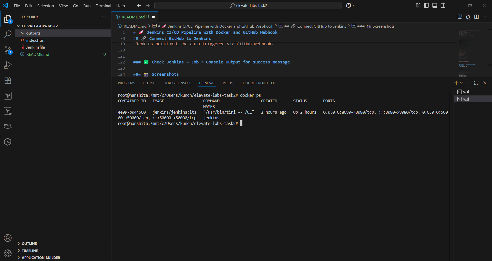
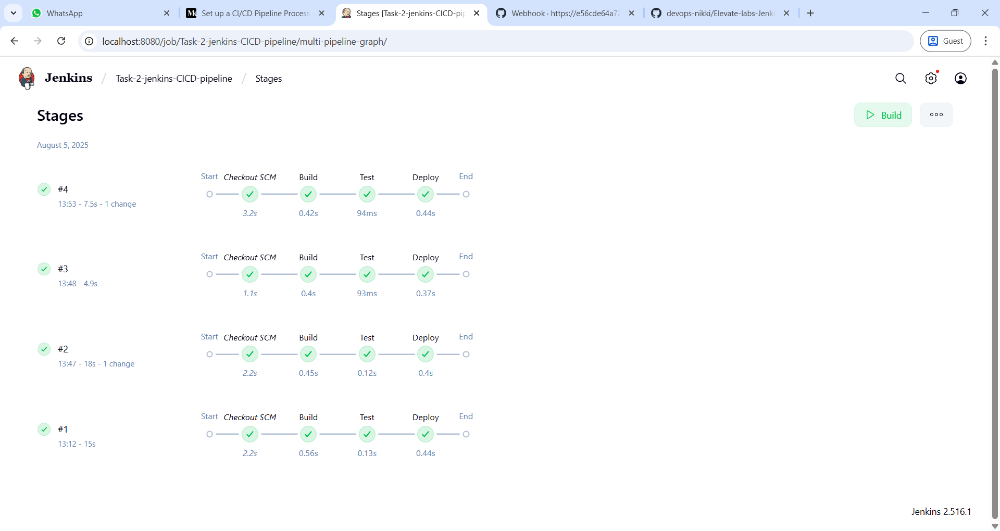
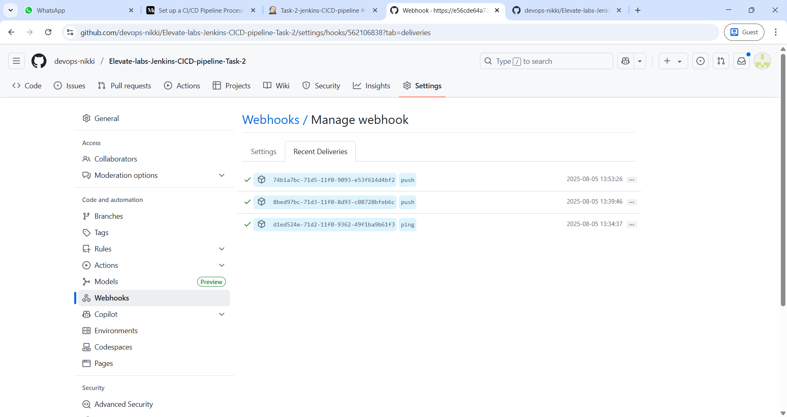
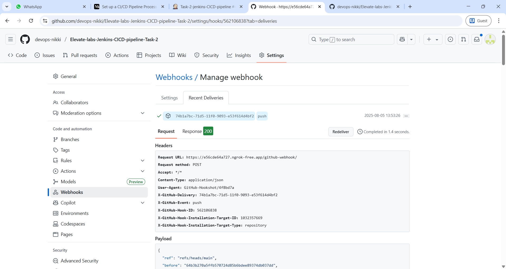

# 🚀 Jenkins CI/CD Pipeline with Docker and GitHub Webhook

This project demonstrates how to set up a **CI/CD pipeline using Jenkins**, where Jenkins is hosted in a **Docker container** and connected to a **GitHub repository** via **webhooks**. The goal is to automatically trigger Jenkins builds whenever code is pushed to GitHub.

---

## 📁 Project Structure
```
. 
├── index.html       # Sample webpage
├── Jenkinsfile      # Pipeline script
├── README.md        # Project documentation
└── outputs/         # Screenshots and outputs
```
---

## 🧰 Tools and Technologies

- **Docker** – to run Jenkins locally in a container
- **Jenkins** – as the CI/CD server
- **GitHub** – version control and trigger source
- **Ngrok** – for exposing local Jenkins to GitHub via a public URL
- **Webhooks** – to trigger Jenkins builds on `git push`

---

## 📌 Objective

- Host Jenkins in Docker locally.
- Create a GitHub repo with a sample HTML file.
- Connect GitHub and Jenkins using webhook.
- Trigger Jenkins pipeline automatically on every push to GitHub.

---

## 🛠️ Setup Instructions

### 1. Clone the Repository

`git clone https://github.com/devops-nikki/Elevate-labs-Jenkins-CICD-pipeline-Task-2.git`

`cd  Elevate-labs-Jenkins-CICD-pipeline-Task-2`

---

### 2. Run Jenkins using Docker

```
docker run -d \
  --name jenkins \
  -p 8080:8080 \
  -p 50000:50000 \
  -v jenkins_home:/var/jenkins_home \
  jenkins/jenkins:lts
  ```
---

### 3. Setup Jenkins

`Visit http://localhost:8080`

`Unlock Jenkins using the password from:`

  `docker exec -it jenkins cat /var/jenkins_home/secrets/initialAdminPassword`

`Install suggested plugins`

`Create admin user and complete setup`

---

### 4. Expose Jenkins to Internet via Ngrok

`ngrok http 8080`

`Copy the HTTPS forwarding URL (e.g., https://abcd1234.ngrok.io)`

---

## 🔗 Connect GitHub to Jenkins

### 5. Add Webhook in GitHub Repo

Go to GitHub → Settings → Webhooks → Add webhook

Payload URL: `https://<ngrok-id>.ngrok.io/github-webhook/`

Content type: `application/json`

Trigger: `Just the Push event`

`Save webhook`

`✅ Webhook test delivery should return status 200 OK.`

---

### 📂 Create a Jenkins Pipeline

Go to Jenkins dashboard → `New Item`

`Choose Pipeline, name it (e.g., CI-CD-Task)`

In Pipeline script from SCM:

`Select Git`

`Paste the GitHub repo URL`

`Set branch as main or master`

Script path: `Jenkinsfile`


`Save and apply`

---

### 🧪 Triggering the Pipeline

Make changes in the `index.html`

Run:

`git add .`

`git commit -m "Trigger Jenkins build"`

`git push -u origin main`

`Jenkins build will be auto-triggered via GitHub webhook.`

--- 

### ✅ Check Jenkins → Job → Console Output for success message.

### 📸 Screenshots

1. Jenkins running inside Docker


2. Jenkins build console output showing success



3. GitHub repo with index.html and Jenkinsfile


4. Webhook Success status when Triggered jenkins pipeline by Github 



---

## ✅ Final Outcome

| 🧩 Component           | 🔍 Status      |
|------------------------|-----------------|
| Jenkins via Docker     | ✅ Running      |
| GitHub Webhook         | ✅ Configured   |
| CI/CD Pipeline         | ✅ Triggered    |
| Jenkins Build Result   | ✅ Success      |

---

### 📖 Conclusion

This project successfully automates a CI/CD workflow using Jenkins and Docker. On every push to the GitHub repository, Jenkins automatically builds the job using the pipeline defined in Jenkinsfile, simulating a real-world DevOps CI/CD process.

---

### 🙋‍♀️ Contact

```
Made by Nikki Goyal

GitHub: https://github.com/devops-nikki

Docker Hub: https://hub.docker.com/repositories/nikkigoyal
```
